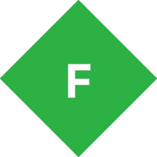

<div align="center">
  
</div>
<br>
I pull apart software to see whats hiding inside. Malware analysis, reverse engineering, vulnerability research and developing. Took down **20+ cheat servers** giving malware to users.
<br>
**languages**

<br>
**tools**
&nbsp;&nbsp;
&nbsp;&nbsp;
&nbsp;&nbsp;
&nbsp;&nbsp;
&nbsp;&nbsp;

<br>
**projects**
<a href="https://github.com/patchrfrfr/Scraper"></a>
<a href="https://github.com/patchrfrfr/BlankDeOBF"></a>
<a href="https://github.com/patchrfrfr/FreeCaptchaSolver"></a>
<br>

<br>
```
$ echo $STATUS
"something is always being reversed."
```
<br>
<div align="center">
  <a href="https://github.com/patchrfrfr"></a>&nbsp;&nbsp;
  <a href="https://youtube.com/@CryptedLikesReversing"></a>&nbsp;&nbsp;
  <a href="https://discord.com/users/patchr"></a>&nbsp;&nbsp;
  <a href="mailto:cryptedsprivate@gmail.com"></a>
</div>
<div align="center">
  
</div> 
